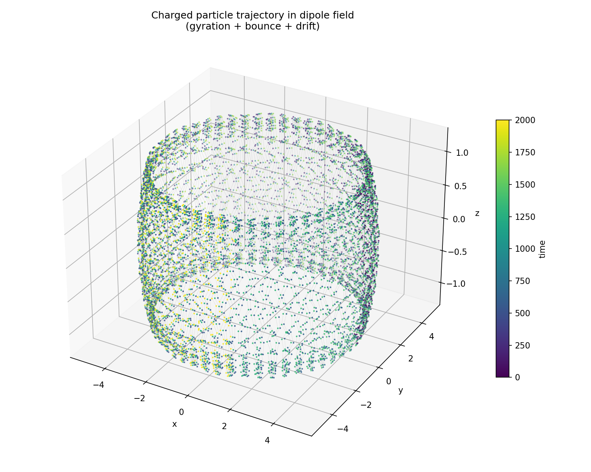
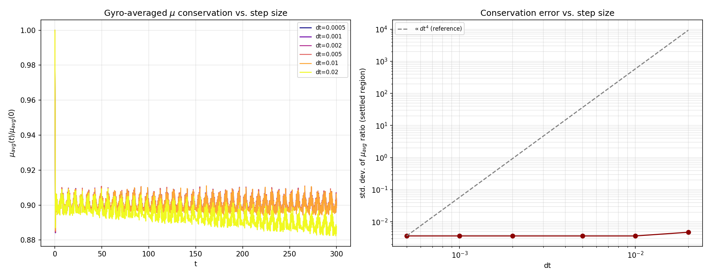

# Charged Particle in a Dipole Magnetic Field
A charged particle trapped in a magnetic
dipole field: gyration, bounce, and drift motion, plus the first adiabatic
invariant and its numerical conservation. Rewritten in C for speed, with
Python used only for plotting the C program's output.

## Physics

A particle with velocity both parallel and perpendicular to a dipole field
line undergoes three nested periodic motions on very different timescales:

1. **Gyration** — fast circular motion around the local field line, at the
   cyclotron frequency `ω_c = qB/m`.
2. **Bounce** — the particle mirrors between high-field regions near the
   poles and moves back and forth along the field line (this is the same
   physics as the Van Allen radiation belts).
3. **Drift** — the guiding center slowly precesses in azimuth around the
   dipole axis, completing a full "drift shell" over many bounce periods.

The **first adiabatic invariant** (magnetic moment),

```
μ = m v_perp² / (2|B|)
```

is approximately conserved whenever the field varies slowly compared to the
gyration timescale. This project computes μ directly from the simulated
trajectory and checks how well that conservation actually holds — including
a subtlety: the *instantaneous* μ has a real, physical ripple at the
gyro-frequency (a finite-Larmor-radius effect in a non-uniform field), so a
**running gyro-average** of μ is used to see the true secular trend instead
of that ripple.

## Architecture

The entire integration loop runs in C — this is a deliberate performance
choice (RK4 needs many evaluations per gyro-period, and a full dt sweep
means running that loop several times over) — and writes its output to CSV.
Python only reads and plots; it does no numerical integration.

```
src/main.c  --(writes)-->  trajectory.csv  --(read by)-->  analysis/*.py  --> PNGs
```

The C code is split so pieces are independently testable and reusable:

- `integrator.c` is **field-agnostic** — it takes a function pointer, so the
  same RK4 stepper drives the SHO test, the dipole simulation, and could
  drive any other ODE with no changes.
- `fields.c` only knows about the dipole field formula.
- `gyro_avg.c` only knows about running averages with an adaptive window.
- `main.c` wires these together into the actual physics problem (Lorentz
  force, initial conditions, output).

## Directory structure

```
.
├── README.md
├── Makefile               # build + reproduce everything (see below)
├── requirements.txt        # matplotlib, for analysis/
├── .gitignore
├── scripts/
│   └── sweep.ps1           # Windows/PowerShell equivalent of `make sweep`
├── src/
│   ├── integrator.h/.c     # generic RK4 stepper (function-pointer based)
│   ├── fields.h/.c         # dipole magnetic field B(x,y,z)
│   ├── gyro_avg.h/.c       # adaptive-window running average for mu
│   ├── main.c              # Lorentz force + simulation driver + CSV output
│   ├── test_sho.c          # validates integrator.c against analytic SHO
│   └── test_fields.c       # validates fields.c against analytic dipole formulas
└── analysis/
    ├── plot_trajectory.py  # 3D trajectory plot from a single trajectory.csv
    └── plot_dt_sweep.py    # mu conservation vs. dt, across the sweep
```

`src/sweep/*.csv`, compiled binaries, and generated PNGs are **not**
committed (see `.gitignore`) — they're all reproducible from source via the
commands below.

## Build & run

**Linux / macOS / WSL** (requires `gcc` and `make`):

```bash
make all          # builds src/main, src/test_sho, src/test_fields
make test         # runs both validation harnesses
make run          # single simulation at default dt -> src/trajectory.csv
make sweep        # six simulations at different dt -> src/sweep/*.csv
```

**Windows (no `make`)** — compile directly with gcc (MinGW-w64) or via WSL:

```powershell
gcc -O2 -Wall -Wextra -o src\main.exe src\integrator.c src\fields.c src\gyro_avg.c src\main.c -lm
.\src\main.exe                       # default run -> src\trajectory.csv
.\scripts\sweep.ps1                  # sweep -> src\sweep\*.csv
```

`main`'s CLI arguments (all optional, positional): `dt`, `nsteps`,
`output_stride`, `outpath`. Defaults: `dt=0.001`, `nsteps=2000000`,
`output_stride=200`, `outpath=trajectory.csv`.

**Plotting** (from `analysis/`, after the C program has produced its CSVs):

```bash
pip install -r ../requirements.txt
python3 plot_trajectory.py ../src/trajectory.csv
python3 plot_dt_sweep.py            # expects ../src/sweep/traj_dt*.csv
```

## Results

**3D trajectory** — gyration + bounce + drift, colored by time. Over the
simulated time span the particle completes many bounce periods and a full
azimuthal drift, tracing out the classic "drift shell" torus:



**Step-size sweep** — gyro-averaged μ conservation across six step sizes
spanning a 40× range (`dt = 0.02` down to `0.0005`), plus the conservation
error scaled against a `dt⁴` reference (RK4's expected local truncation
error order):



The key finding: conservation quality is essentially **flat** across most of
this range — the settled-region error sits at ~3.6×10⁻³ regardless of `dt`,
only degrading at the coarsest step (`dt=0.02`, ~39 steps per gyro-period).
This means RK4's numerical error is not the limiting factor for invariant
conservation here; the residual offset and ripple are real physics (an
initial transient settling onto the natural orbit, plus bounce-timescale
modulation of the gyro-average window) rather than integration error.

## Possible next steps

- Second adiabatic invariant `J = ∮ v_∥ ds` (needs bounce-point detection)
- Tokamak-like field geometry (toroidal + poloidal) for banana orbits
